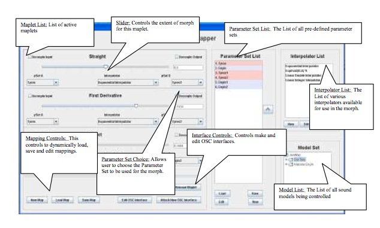

Just finished the graded part of my FYP today. What a ride! Its rightfully 12MCs. Trust me!

First, let me thank **sweska**, **jazz** and TheWeed for actually coming down to my presentation. Especially **TheWeed**, I know u were really sleep deprived. **appreciate it **!

For those who missed it an image of my GUI!

I was thinking of bloging abt FYP before. and not in a positive way. But I realised that I got to learn a lot. And not only about academic matters but life in general.

**Positive thinking.**
Was complaining about the 30mins limit on my presentation when my supervisor snapped back, "_I have an hour to explain 6 years of **PhD** level research_". Things can always be worst off. Just be happy with what you have..

**Sacrifices.**
Haven't had a game on my laptop since start of last sem. Life is all about sacrifice, just be sure of what you want to keep and what you want to sacrifice.

**Perseverance.
**If not for this.I would have never been able to clean the 100++ bugs I found in my code. Last one found and cleaned 10hrs before presentation..

**Passion.
**Passion will take you through everything, good, bad and ugly. You just need to find your passion. Its not easy, I am **not** sure I have found mine, but try.

**Time management.**
OK. This one I learnt the hard way. Supervisor had once said, "_Don't leave everything for the last month ah_". I was like, _"Of course I won't!_". Who was I kidding??

Anyway, FYP is not done yet, still have _another draft_ to do, and a **HUGE** amount of code to clean-up, debug and document. Sigh, back to work.
