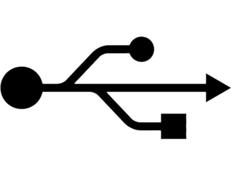

_Warning : Super technical, geeky post ahead!_

I was watching [Episode 52 of Systm][0], and [Patrick][1] was trying to hack/mod an iPod/iPhone connector to allow it to charge using various sources other than the USB port of your computer. He also wanted to get the line out audio from the connector to connect to any Audio System.

_Aside : Systm has just revived into the awesome show it started as. Patrick did one on distillation, two on iPod/iPhone hacking/modding and possibly more coming up. Do watch it if you are interested in this type of stuff._

So, Patrick was able to power up and charge the iPod (a 5th Gen iPod, I believe) by connecting just the [VDC and GND pins][2] of the connector to a 5V supply (possibly a VCC pin on a USB cable) and GND respectively, the same did not work on the iPhone. **Why?**

[][3]

For this we need to look at [USB's electrical specs][4], especially the power sinking and supplying parts.

There are 3 classes of USB hosts and 3 classes of USB devices/functions defined in the specs. Hosts are devices like PCs, USB hubs, etc, which can connect to multiple devices and act as the "Master" in most transactions. Devices are "Slaves" in a USB connection. All cameras, phones, thumb drives, etc are considered as devices.

> The power source and sink requirements of different device classes can be simplified with the introduction of the concept of a unit load. A unit load is defined to be 100 mA. A device may be either low-power at one unit load (100mA) or high-power, consuming up to five unit loads (500mA). **All devices default to low-power.** The transition to high-power is under software control. It is the responsibility of software to ensure adequate power is available before allowing devices to consume high-power.

So the 3 USB Host Classes are..

> **Root port hubs:** These are directly attached to the USB Host Controller. Systems that obtain operating power externally, either AC or DC, must supply at least five unit loads to each port
>
> **Bus-powered hubs:** Draw all of their power for any internal functions and downstream facing ports from VBUS on the hub's upstream facing port. Bus-powered hubs may only draw up to one unit load upon power-up and five unit loads after configuration.
>
> **Self-powered hubs:** Power for the internal functions and downstream facing ports does not come from VBUS. However, the USB interface of the hub may draw up to one unit load from VBUS on its upstream facing port to allow the interface to function when the remainder of the hub is powered down.

And the 3 USB Device Classes are..

> **Low-power bus-powered functions:** All power to these devices comes from VBUS. They may draw no more than one unit load at any time.
>
> **High-power bus-powered functions:** All power to these devices comes from VBUS. They must draw no more than one unit load upon power-up and may draw up to five unit loads after being configured.
>
> **Self-powered functions:** May draw up to one unit load from VBUS to allow the USB interface to function when the remainder of the function is powered down. All other power comes from an external (to the USB) source.

So basically, there are hosts that can supply up to 500mA and devices which can sync up to 500mA. However, all **hosts and devices** will default to supplying and sinking (respectively) 100mA. And to switch to the high power mode, the device software ([USB Stack][5]) has to request the host to start providing 500mA. This request has to be done through the **Default Configuration Pipe of the connection, using "SetConfiguration" USB Device Request.** In this configuration, the value of maximum current, in mA, can be set. However, these requests go over the D+ and D- USB pins, since all **data** goes over those pins. And so, these pins have to be connected to allow the Device to request 500mA.

Now that explains why many times our devices just can't charge over those USB Wall-Chargers, because they request and expect 500mA charging configuration, but since the USB Wall-Chargers are not "hosts", and don't have any micro-Controller or any USB Stack running, they cannot reply to these requests. For that matter, most of them, just like Patrick's charger, don't even have D+ and D- pins at all. And **since the device can't get 500mA, it can decide it can't charge and stops**.

So now, finally the question is, why can an iPod charge on 100mA (I have tried it using a USB Wall-Charger, it works), but the **iPhone** can't.

The answer is simple, iPhone has a GSM radio for the cellular telecommunications. And GSM radios draw huge amounts of currents when they broadcast the data in bursts. So during these bursts, they may sink in the range of 70mA. So if you have a flat battery, and **a charger providing only 100mA, and a radio sinking 70mA, only ~30mA is left for the other components** including the touch screen and the backlight. Running on low current might cause many issues, especially on displays and touch sensors. So Apple must have decided to only charge the iPhone, (and in the case of low battery, allow it to boot-up), if 500mA configuration has been successful.

_There you go, some interworking of USB and Charging on devices. Drop me an email, or comment on this post, if you have any questions or queries about these things, and I will try my best to answer them._

[0]: http://revision3.com/systm/ipodcables
[1]: http://twitter.com/patricknorton
[2]: http://pinouts.ru/PortableDevices/ipod_pinout.shtml
[3]: ../images/2008/06/img_3160_usb-logo.jpg
[4]: http://www.usb.org/developers/docs/
[5]: http://www.freebsd.org/doc/en/books/arch-handbook/usb.html
