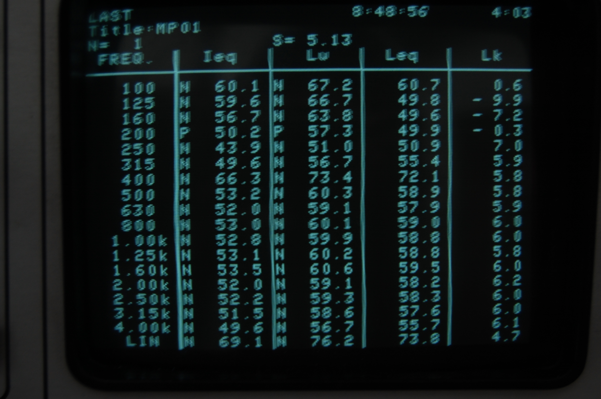
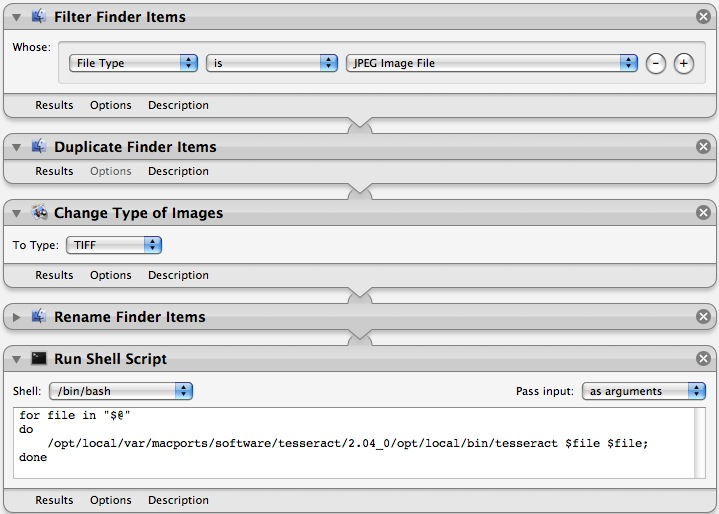

Necessity is the mother of invention it is said.. And sometimes it just takes an annoying repetitive task to psuh someone to do something..

I've always been interested in [Applescript][0] and [Automator][1]. These are Apple's scripting/automating/batch processing frameworks. Applescript is basically a scripting language which allows you to command many OSX apps. The amount of control you have exert over the running of the apps depends on how the app was made (if they put in the hooks for apple script or not), but most Apple apps are pretty 'scriptable'. Automator is automation for _noobs_. Instead of writing a script, you just drag and drop "actions" and create a "[workflow][2]", which lets you pass outputs of one action to another and process them. It seems pretty lame at first, but once you start making your own droplets and 'workflows' it's great fun!

So, during one of my labs, the analyzer we were using was unable to store/save the data we captured during the experiment. It was an old analyzer which used 3.5" floppy disks, but the disk drive has stopped working. So we decided to take photos of the small screen of the analyzer when it displayed the data, and the transcribe them later.

When I saw the sheer number of file which needed to be transcribed (and also my entire evening gone doing that), I thought of doing some OCR (Optical Character Recognition). Google helped me to find [Tesseract][3], a \*nix utility which does OCR. Great. I managed to find a [MacPort][4] for it and got it to [run on OSX][5].

OK.So far so good, but Tesseract only accepts 1 file as an input and requires that file to be in .tiff format. Now I could have written a bash (or perl :P) script to convert all the files to .tiff and then loop over all the files and call Tesseract but that's too much work and surely not the 'Apple way'. So, I called on Automator.

After a bit of tweaking and testing, here is my final workflow which creates a [droplet][6]. Any jpg file dropped on this droplet is duplicated, coverted to .tif and OCRed through Tesseract and the output is stored in a file with a suffix .txt

The OCR output was not the best. I had to massage (crop, rotate, gray-scale, etc) the images to get a good output.

You can download it [here][7], but you'll need Tesseract to make it work. Yay!

Btw, if you're interested in Automator, check out the [videocast Macbreak ][8]Ep235-238\. And also Ep4-13 of [MacBreak Dev][9]

[0]: http://www.macosxautomation.com/applescript/index.html
[1]: http://www.macosxautomation.com/automator/
[2]: http://www.macosxautomation.com/automator/examples/workflows.html
[3]: http://code.google.com/p/tesseract-ocr/
[4]: http://www.macports.org/
[5]: https://trac.macports.org/browser/trunk/dports/textproc/tesseract/Portfile
[6]: http://macscripter.net/viewtopic.php?id=24775
[7]: http://dl.getdropbox.com/u/957/ocrJpg2tiff.zip
[8]: http://feeds.pixelcorps.com/feeds/macbreakipod.xml
[9]: http://www.pixelcorps.tv/macbreak_dev?p=3
