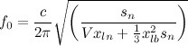
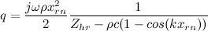
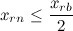
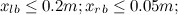

For the resonator project, I am working on an 'semi-automated' method to 'design' a resonator.

The idea is simple. The resonance frequency of each Helmholtz resonator depends on it's physical dimensions (neck length, nech witdh, cavity length, cavity width). The resonance frequency is determined by a the following formula.

f\_{0} = frac{c}{2pi}sqrt{left(frac{s\_n}{Vx\_{ln}+frac{1}{3}x\_{lb}^2s\_{n}}right)}

Now, for the application I am looking at, optimizing _q_ which is the source strength of each resonator when mounted flush to the ground is something which helps to acheive the most effect of reduction. So we have to optimize the physical dimensions of the resonator for the largest value of _q_.

q = frac{jomegarho x\_{rn}^2}{2}frac{1}{Z\_{hr}-rho c (1 - cos(kx\_{rn}))}

So this becomes a problem of constrained optimization. We have to optimize the physical dimensions **x **to optimize _q, w_hile still ensuring that the resonance frequency is kept the same.

Thinking more, we can come up with a few more constraints from the physical perspective to narrow our search region.

So, we ensure that the neck width is smaller (less than 0.5) of the cavity width. And a size limitation (we don't want to search for solution with really large size), so we can have the following constraints.

x\_{rn}leq frac{x\_{rb}}{2}

x\_{lb} leq 0.2m;x\_{rb} leq 0.05m;

So, this is a clasic problem of [Constrained Optimization][0]. The basis idea being classical Constrained Optimization techniques is that you generate 'cost functions' from the constraints and then subtract these 'costs' from the the value being optimized. The[Lagrangian Multiplier][1] method is one such method which is pretty straight forward. If you are interested in understanding the underlying theory and proofs behind these methods I recommend [this ebook by Prof. Bertsekas][2].

For my case, I hit two problems. Firstly, I am not sure if the Lagrangian method would work on my functions, it's gurateed to work on convex functions, but the expression for _q_ is pretty complex to analyze and know the form of. Secondly the basic Lagrangian method needs one to derivate over all the variables (both system variables and the lagrangian variables). Here it gets really messy and prone to bugs.

Still I think it's interesting to anazlyse problems like these theoritically. A theoratical solution allows a simpler and more elegant implementation of such a design tool. Ofcourse the alternative is a numerical method, which will compromise accuracy and speed for ease of implmentation.

[0]: http://en.wikipedia.org/wiki/Constraint_optimization
[1]: http://en.wikipedia.org/wiki/Lagrange_multiplier
[2]: http://www.mit.edu/people/dimitrib/lagrmult.html