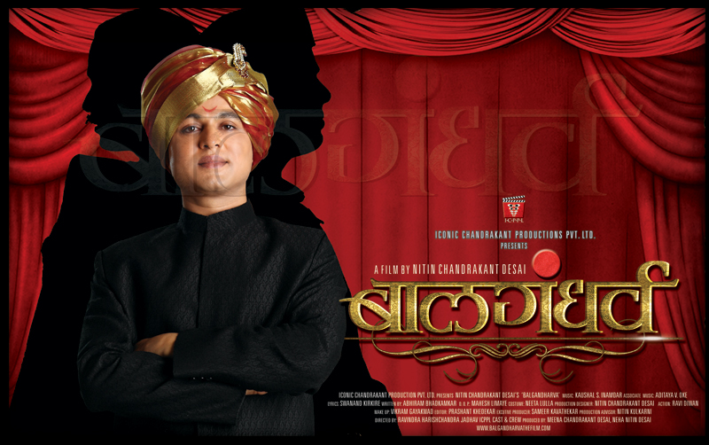
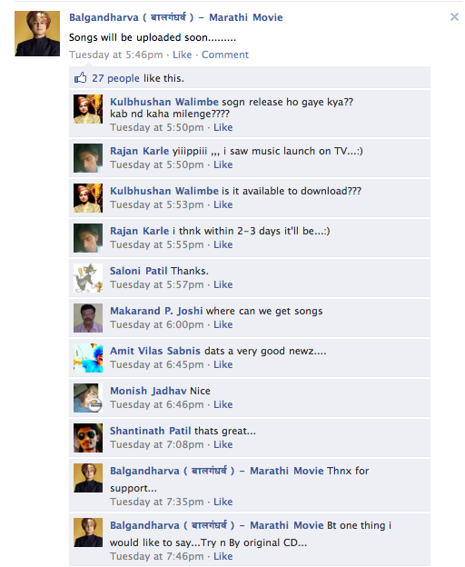

**Update**: The music was finally released under the Saregama label, and you can[find it here][0]..

--------

Recently, a Marathi movie about a very famous Marathi Musical Theatre personality of old, was announced.. [Balgandharva][1]. The movie had many 'up and coming' names attached to it, including the famous Art Director [Nitin Chandrakant Desai][2] (NCD) of [Devdas][3] fame producing it.

[][4]

A few things really struck me about this movie, when I watch the [first trailer][5] (be sure to watch it in HD)..

1\. It is really well done. For starters, the trailer was uploaded to Youtube in HD. That really helped to grab the mood of movie. Not only that, but NCD did mention in one of the interviews that they had used new cameras and video technology (not sure exactly what they used) to capture the beautiful NCD sets in all their glory. This can be seen in the great control over focus, bokeh and colour that can be seen in the trailer.

2\. Even in the trailer, the music was especially well done. High bit rate in the file uploaded was noticeable and so was the significant thought on not only the orchestration but also the 'polishing' and 'mastering' of the music. Very well done indeed!

The fact that such effort was showcased in the trailer tells a lot about the understanding, the team behind the movie, has of the technology and media which they are using to capture and display the movie. And yet the movie is set in the early 1900s, but care has been taken to hide the abuse of such technology in both video and music, as we can notice from the trailer.

The other thought came after reading some comments on the [Facebook page of the movie][6] (esp. the last comment).

[][7]

For a movie with a theme, which has so much do with music, and furthermore in a market like India, **what strategy of music distribution should be adopted?**

The soundtrack of this movie has 21 tracks/songs. Most based on the[songs of Balgandharva from the yesteryears][8] and they are really well produced. It truly sounds like a masterpiece in making from the trailer. Hence the super heightened expectations from the fans.

However, piracy of music is extremely common in India. I do remember growing up, copying cassette tapes was so rampant, that we didn't know that it was 'illegal'. The culture of 'sharing' music (and videos) has forced many companies adopt very unusual business models to combat this piracy. You could call me presumptuous, but one can sense that many fans who're so intent on downloading the music for this movie might not want to pay for it..

**So how can the music of such an epic movie be distributed??**

As a fan of the production and artists involved, I definitely want them to make as much money as they can off the film. They deserve it for all the work one can see put in.. And someone who doesn't live in India, I wish I was able to download and listen to the music in high quality as soon as it's published. So where can be draw the line?

We know that [DRM][9] is a [broken solution][10] for various reasons (hard to use, expensive, unsustainable, etc). The main reason why most of US and European Music Industry was able to go beyond DRM and freely distribute non-DRM music online with a new model is the support from the infrastructure and society. Fast and ever available internet makes apps like [Spotify][11], [Rdio][12] viable alternatives to piracy. Furthermore, the structure of the music industry, (mainly based on bands), makes it easy to have fans supporting single entities, and thus not pirate those bands.For eg. It's easy to say, I love[Nice Inch Nails][13] and I won't pirate their music as I want to support them.

But in India, 3G has just been launched. Internet has barely penetrated the market. And within the Indian movie music industry is so hard to support a single entity as they change teams with every movie. Furthermore, economics is a big factor, where a 99¢ song makes sense in the US for most people, the same cost is prohibitively expensive for many fans in India.

I don't have an answer for this. But I do hope that there is one, and we will all be able to enjoy, encourage and support the music (and movies) that we love in the future. But for now, I have $20, right here in an envelope , to drop on a downloadable version of this soundtrack the second it comes out.. Come get it!

[0]: http://www.saregama.com/portal/pages/music.jsp?previousRequestUrl=film?mode=get_album_info%26albumId=190770
[1]: http://en.wikipedia.org/wiki/Bal_Gandharva
[2]: http://en.wikipedia.org/wiki/Nitin_Chandrakant_Desai
[3]: http://en.wikipedia.org/wiki/Devdas_(2002_film)
[4]: ../images/2011/04/photo_gallery_images_1.jpg
[5]: http://www.youtube.com/watch?v=CyQxlzWS3Jc&hd=1
[6]: https://www.facebook.com/pages/Balgandharva-%E0%A4%AC%E0%A4%BE%E0%A4%B2%E0%A4%97%E0%A4%82%E0%A4%A7%E0%A4%B0%E0%A5%8D%E0%A4%B5-Marathi-Movie/172188729473450
[7]: ../images/2011/04/Screen-shot-2011-04-28-at-11.16.10-AM.png
[8]: http://courses.nus.edu.sg/course/ellpatke/Miscellany/bal%20gandharva.htm
[9]: http://en.wikipedia.org/wiki/Digital_rights_management
[10]: http://bradcolbow.com/archive/view/the_brads_why_drm_doesnt_work/?p=205
[11]: http://www.spotify.com
[12]: http://www.rdio.com
[13]: http://nin.com/
