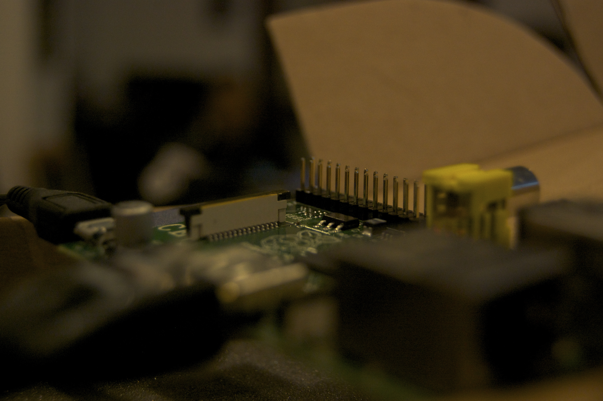

What's with product being named as fruits? Apple, Blackberry and now a [Raspberry][0]. I've been following the development of the Raspberry'Pi since it hit the inter-webs. The concept was really great. An open source low cost ($25) ARM based board which runs some flavor of linux. Targeted for education, it provided an affordable computer which students/kids could use to start experiencing computing, electronics and start programming easily. But the best part was response from the public. Basically what the originators [expected to be a few hundred units order became a few hundred thousand units][1]. Everyone loved the concept and of course the price point. One could say that the "[One Laptop per Child][2]" premise could be finally fulfilled by this.

[][3]

But I digress, the wide-spread interest in this board both from software hackers (it [runs Linux][4] and python out of the box) and hardware hackers (it has some [12 GPIO pins doing SPI, I²C, UART, etc][5]) sparked communities all around the world. In Singapore we had our own ["Raspberry'Pi & Co Singapore" Facebook group][6]. What started off as a place to compare where to order a Raspberry'Pi and when who's gonna get their board when, became a nice community sharing ideas, tips and tricks. There were discussions about everything from various Linux distros and libraries to use on the Raspberry'Pi to builds, mods, cases and even alternative hardware platforms to play with while everyone waited anxiously for the Pi.

When the boards finally shipped to the lucky few individuals, a meetup was proposed to share ideas, and also give those without a 'Pi board a chance to touch and feel the boards themselves. Thanks to our dear friend at [Hackerspace][7], [Michael Cheng][8] and [CJ][9], the meetup was held there. Members of the community who had the boards were encouraged to bring them down and do a "Show and Tell" session on what they were doing with their Pi and what they planned to do with it.

[][10]

On the last day, we found out about the [Raspberry Jams][11]. These basically are community events, similar to the one we were going to organize, happening in a few places in the UK and around the world. In support of our brethren, our event was changed from just a meetup to Raspberry Jam.

To start off the session we watched a [video of a panel at the recent Maker::Faire Bay Area][12] featuring [Eben Upton][13] the founder of the Raspberry'Pi, [Ben Heck][14], [Matt Richardson from MAKE][15] magazine about Maker movement in the classroom.

[][16]

Following that we had two great sessions from [Mike Veltman][17] and [Calvin Cheng][18]. Mike explained the various versions of Linux he played with to get a stable setup. Once he had that he setup his 'Pi as a home media server, as well as a reverse proxy server. He has 5TB worth of storage attached to the 'Pi, and with a [miniDLNA][19] running on it, he could stream his media to DLNA players on his mobile devices. The [reverse proxy][20] allowed him to tunnel and access websites which were banned in some countries he was visiting. And finally, the small form factor of the 'Pi helped with the [Spousal Acceptance Factor (SAF)][21] something that geeks all over the world have to deal with.

[][22]

Calvin Cheng had something else up his sleeve. He unveiled his new project, [littlehackers][23]. He is looking at building a batch (like 10) of Raspberry'Pi based small portable computers to teach young children programing. He has been sourcing for small portable displays for that build as well as getting education software like [Scratch][24] running on his Pi.

[][25]

Afterwards there was a long discussion on the hardware itself and things one could do attach to it and many project ideas. The 'Pi promises to a great enabler for all sorts of geeks, and the excitement was obvious in the attendees. For the members who hadn't seen a Raspberry'Pi they got look at the board for themselves. For the rest, many ideas were exchanged. Overall it was a great meetup.

[][26]

The next Raspberry'Pi Jam Singapore is being planned for a September/October time frame so most people would have gotten their hands on the 'Pi boards and played around with things to share more.

\[gallery link="file" orderby="title"\]

[0]: http://www.raspberrypi.org
[1]: http://vr-zone.com/articles/rs-components-previews-raspberry-pi-in-singapore/15684.html
[2]: http://en.wikipedia.org/wiki/One_Laptop_per_Child
[3]: ../images/2012/07/DSC_7599.jpg
[4]: http://elinux.org/RPi_Distributions
[5]: http://elinux.org/RPi_Hardware
[6]: https://www.facebook.com/groups/raspberrypisingapore/
[7]: http://hackerspace.sg
[8]: https://www.facebook.com/miccheng
[9]: https://www.facebook.com/changcj
[10]: ../images/2012/07/DSC_7608.jpg
[11]: http://raspberryjam.org.uk
[12]: http://fora.tv/2012/05/19/Maker_Movement_Heads_to_the_Classroom_with_Raspberry_Pi
[13]: http://raspberrypi.org/about
[14]: http://revision3.com/tbhs
[15]: http://blog.makezine.com/author/makemattr/
[16]: ../images/2012/07/DSC_7583.jpg
[17]: https://www.facebook.com/mike.veltman
[18]: https://www.facebook.com/calvin.cheng.lc
[19]: http://sourceforge.net/projects/minidlna/
[20]: http://en.wikipedia.org/wiki/Reverse_proxy
[21]: http://en.wikipedia.org/wiki/Wife_acceptance_factor
[22]: ../images/2012/07/DSC_7586.jpg
[23]: http://littlehackers.com
[24]: http://scratch.mit.edu/
[25]: ../images/2012/07/DSC_7607.jpg
[26]: ../images/2012/07/DSC_7604.jpg