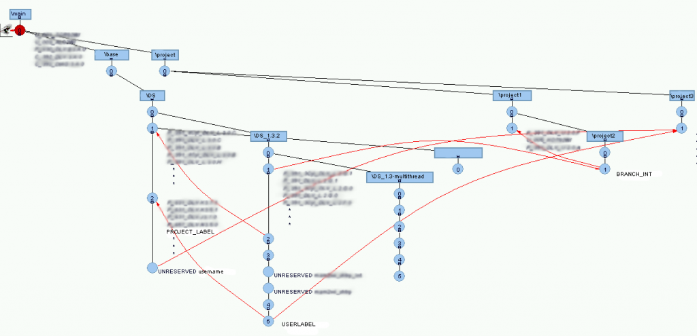

Versioning systems is probably the thing that's argued about next most often after editors when it comes to developers. I remember the [CVS][0] vs [SVN][1] [arguments][2] when I first started to know about versioning systems. As always the inertia makes it hard for people to move unless there is a feature which really makes their life easier.

Sad to say, I never learnt about CVS or SVN while in school. My first versioning system was [Clearcase][3] (oh! the horror). But it was a large corporation. Everyone was using clearcase, and there was definitely loads of support (tutorials, scripts, and people) to pick up and get good at clearcase. We did [crazy configuration management with clearcase][4]. Massive merges which took hours, and script which automated all sorts of build, version and release processes. The horror faded away to efficiency (alias were my best friends) and effectivity. It was a [heavy duty industrial strength system][5] which was able to bend and work as per your will. It has it's quirks, but nothing a little bash script couldn't solve. And my favorite part was the nice version trees it could make and show. It was great for a noob like me.

[][6]

A part of my second job was to upgrade the web server, which incidentally also hosted the local code repository. That's when I first looked at [git][7]. Being new and shiny, I wondered if it was a viable upgrade to the current SVN system that was being used. But it was shot down by engineers too used to SVN and not wanting to move.

After that my need for heavy duty versioning died. Most code was personal projects which rarely had multiple versions. I relied on [Dropbox for basic versioning][8] ("oops I accidentally deleted a file I wanted") but that was that.

[][9]

At my current job, we used SVN. It was the first time I had to do heavy branching with SVN (multiple platform support). And that's what made me get annoyed. The whole dumb copy idea of branching was so confusing. To add to that the [SVN client on both Windows][10] and [OSX][11] were next to horrible. It was hard to understand what was going on and why there were errors in merges. Error messages were cryptic and most importantly there was no community to rely on for help.

[][12]

When I found out that our online code repository supported git, I immediately moved everything to git. Boy was that a great idea! Coming from clearcase, git has a very small initial learning curve. Some concepts are a little hard to grasp. In clearcase setup I used, [all files were read-only till you checked them out][13]. While in git, your files are always "checked out". The whole [staging thing in git][14] is also a little confusing at first. But what really helped was the millions (and I'm not kidding) of git videos, tutorials and stackoverflow answers there are. From the smallest thing to the weirdest operation, there's someone to help you out in whatever you're trying to do. And THAT was my golden ticket. The [community around git][15] really make git a great versioning system for me. If I'm stuck I can find commands/scripts/tricks just by asking around. This also applies to tools used for git (although I'm sticking to command line on OSX). On OSX there's a plethora ([GitBox][16], [Tower][17], [Github][18], [SourceTree][19]) of beautiful looking tools if you don't like CLI. On Windows [GitExtensions][20] is a very intuitive tool with a nice tree showing your repo. And then there's [github][21]..

<iframe id="ytplayer" type="text/html" width="640" height="390" src="http://www.youtube.com/embed/Foz9yvMkvlA?&origin=http://chinpen.net/blog"  frameborder="0"></iframe>

tl;dr: My reasons for moving to git is the community around it and the availability of great tools.

[0]: http://en.wikipedia.org/wiki/Concurrent_Versions_System
[1]: http://en.wikipedia.org/wiki/Apache_Subversion
[2]: http://stackoverflow.com/questions/245290/subversion-vs-cvs
[3]: http://www-01.ibm.com/software/awdtools/clearcase/
[4]: http://techpubs.sgi.com/library/dynaweb_docs/0620/SGI_Developer/books/ClrC_CG/sgi_html/ch01.html
[5]: http://stackoverflow.com/questions/645008/what-are-the-basic-clearcase-concepts-every-developer-should-know/645771#645771
[6]: http://svn.haxx.se/dev/archive-2006-07/0171.shtml
[7]: http://git-scm.com/
[8]: https://www.dropbox.com/help/11/en
[9]: http://chinpen.net/blog/2012/11/why-im-starting-to-like-git/subversion/
[10]: http://tortoisesvn.net/
[11]: http://subclipse.tigris.org/
[12]: http://chinpen.net/blog/2012/11/why-im-starting-to-like-git/git-logo-2color/
[13]: http://publib.boulder.ibm.com/infocenter/cchelp/v7r1m2/index.jsp?topic=/com.ibm.rational.clearcase.cc_admin.doc/topics/r_access_view_dynamic.htm
[14]: http://betterexplained.com/articles/aha-moments-when-learning-git/
[15]: http://stackoverflow.com/questions/tagged/git
[16]: http://www.gitboxapp.com
[17]: http://www.git-tower.com
[18]: http://mac.github.com/
[19]: http://sourcetreeapp.com
[20]: http://code.google.com/p/gitextensions/
[21]: https://github.com/notthetup
