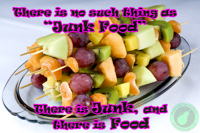

I love developer communities. I love the spirit, the comradery and energy. But in the last couple of years or so, Hackthons have spread through the community like a plague. There are Hackathons around technologies, ideologies and everything in between. And I feel there is an urgent need to eradicate them.

Here is my main beef with Hackathon. They're encouraging and spreading a perverse culture of unhealthy lifestyle and unsustainable workflow which has been made popular by sensational media and film.

Here's a standard recipe for a Hackathon.

1. Gather a bunch of developers in a location.
2. Supply them copious amounts of junk food, booze and caffeine.
3. Tell them to get cracking for 24hrs.

Sounds familiar?

[][0]

---

#### Sleep

There is an almost masochistic take on sleep deprivation in the developer community. (It might be true with other professions, but let's focus on the devs.) Working late into the night and not sleeping for days is lauded and almost considered a necessity by many these days. Hackthons, many of which last 24hrs, only serve to glorify that.

It is well-known that sleep deprivation has only negative effects on health. Sadly, popular culture in the community has only strengthened the indifference towards health. Y-combinator's popularized (and prefered?) archetype for founder/developers who eat ramen and code into the night, or the life of Mark Zuckerberg as showcased in the movie The Social Network only make things worse.

And leaving long-term health out of the equation, lack of sleep hasn't been known to improve your focus or the ability to be logical or creative, all of which are critical skills for developers.

When was the last time you wrote a piece of code while being totally sleep deprived, and looked at it after you woke up to say it was the most beautiful, elegant and awesome piece of code you've ever written?

A good nights rest and a fresh mind are critical for a good developer, that's one thing that Hackathons completely miss.

#### Food and Drink

Next to sleep, your body needs good fuel to keep going. And NO! I don't mean coffee. As much as I love my coffee, binging on coffee, red bull or is rarely good for focus. Not to mention alcohol, which makes matters worse.

It's a short-term vs long-term trade-off. Coffee (and possibly alcohol, although I am skeptical abt it), do help you feel more focused in the short-term. But both caffeine and alcohol are diuretics and only make you lose more water in the long-term. A dehydrated body isn't much of a help when you need your brain to focus and solve problems. "When was the last time you saw an isotonic drink at a Hackathon?"

Junk food isn't much of a help to that. I am not even going to touch on long-term effects of eating high carb diets. The usual Hackathon menu of pizza and candy is full of carbohydrates. While sugar highs are great for short-term focus (maybe??) you tend to feel hungry very quickly after a carb heavy meal. That only means you going around for another round of pizza/candy etc. Not really the best way to focus is it?

#### Sedentary lifestyle

More and more research is showing a link between a [sitting lifestyle and health issues][2]. Developers are unfortunate to have a job which is inherently sedentary. Hackthons again make it worse by inciting developers to sit at the same place for 24hrs. "I'm sure your back will thank you at the end of that!".

And what's worse is since most Hackathon are held on weekends, the one day you usually get to be active is also spent being sedentary.

#### Distraction

Hackathons are distraction. There are a ton of things going on. People are talking, discussing ideas, giving talks or just hanging out. All that is competing for your attention while you need to focus. Add caffeine to that mix and that's one hell of a party on thought in your mind. Noise cancelling headphones help, but then what's the point?

#### Solutions?

I'm pretty sure there are better ways to organize hackthons. Having them over 2 days of 12hrs slots would be an idea, to combat sleep deprivation. Supplying and encouraging healthier eating and drinking options would be really useful. Fruits, nuts, and other healthy food are options. Similarly with drink, having access to isotonic drinks and lots of plain water should be a priority. Encouraging participants to do physical activities like calisthenics or just going out for walks on a regular schedule are options to consider.

But in the end, I really feel that Hackathons are beneficial less as a place and time to code out your next big idea, but more of a time to mingle and bond with the community. It's like a gathering of the tribe. And personally, there is more value in that than actually developing anything.

**TL;DR; :** Hackthons promote unhealthy lifestyle. If you're organizing one, urge your participants to hydrate regularly, eat healthy meals and take regular breaks where they do some type of physical activities.

[0]: http://xkcd.com/323/
[2]: http://en.wikipedia.org/wiki/Sedentary_lifestyle#Health_effects
