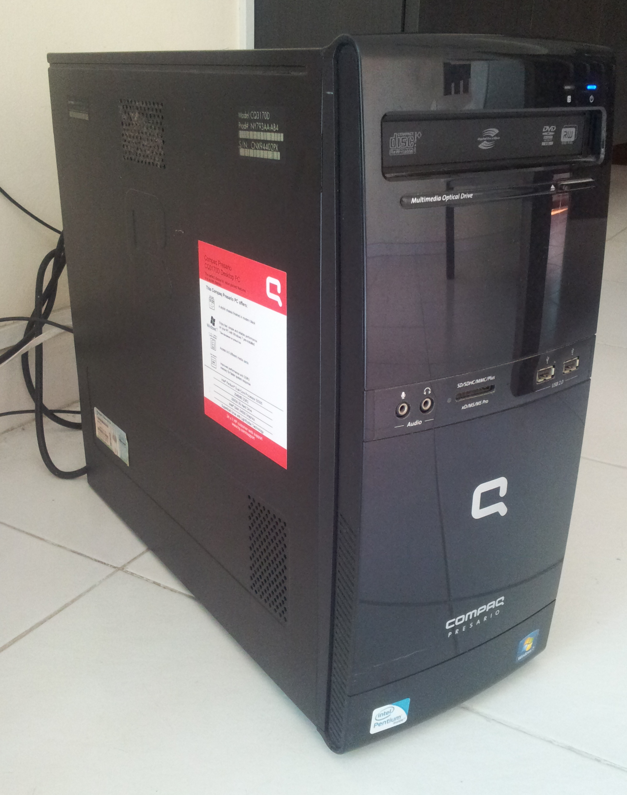
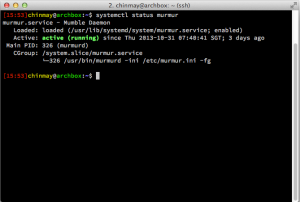
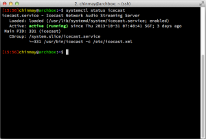
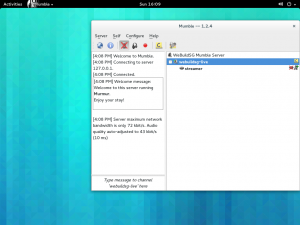
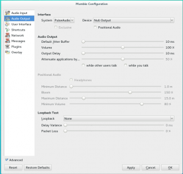
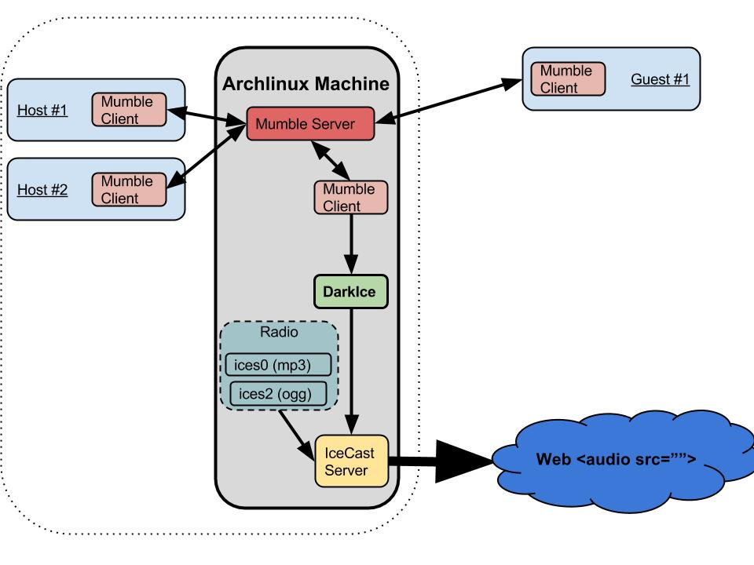
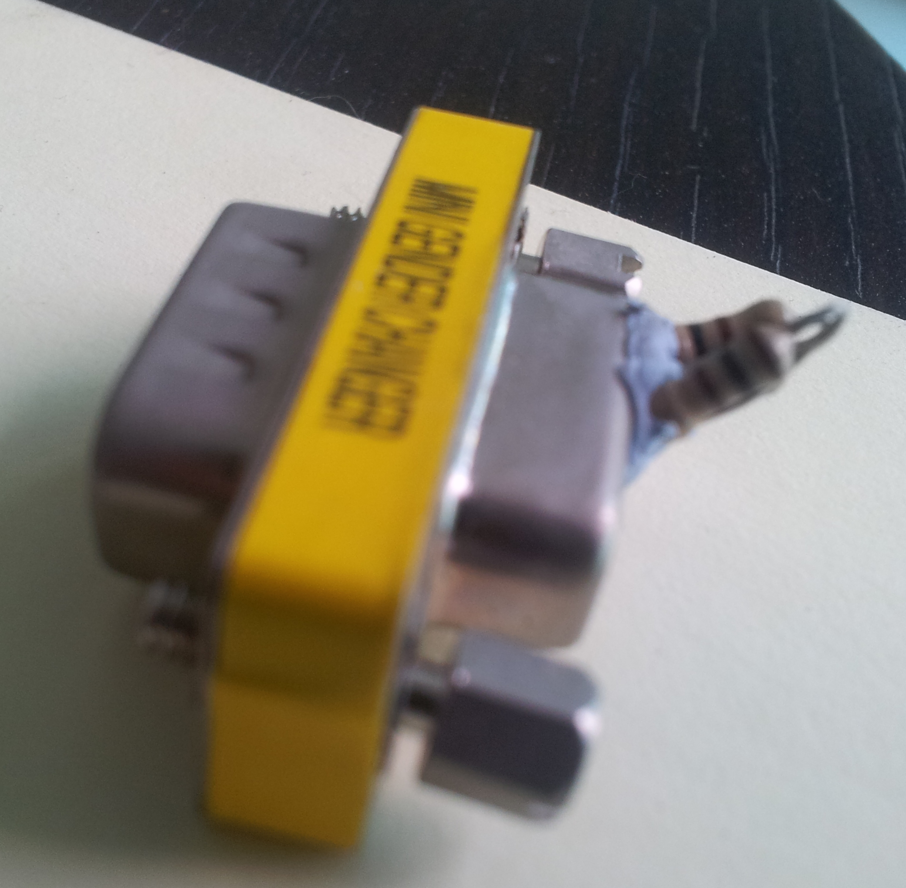

For my[new (it's almost 3 months old already) podcast][0] we had an idea of streaming the recording live. Also I had decided to leave Skype for [Mumble][1]. Skype was getting too unreliable and Mumble supported[separate channel recording][2] for each connected client, which would make post processing much simpler.

So I setup a spare box (Pentium(R) Dual-Core E6300, 4GB) to run [Archlinux][3] (which turned out to be kind of a bad idea in the end). I am lucky to get a pseudo-static IP from my ISP but I got [Dynamic DNS ][4]setup using [ddclient][5] just incase.

Next was to run a [Mumble server (Murmur)][6]. It's pretty easy to setup and usually has been downstreamed to the most distro repos. I setup a single "room" on the server and ensured the server was password protected. With that I was able to connect using the Mumble clients inside and outside my network and have a proper podcast recording at high quality. With some port forwarding on my router I had the server accessible from outside. [iptables][7] were of course necessary to keep the naughty people away.

[][8]

[Icecast][9] was the obvious option for the streaming bit. It's pretty easy to setup (again look in your repos) and has a ton of features to control the audio quality and other server settings. Again port forwarding was needed for the Icecast server as well.

[][10]

The only interesting issue here was streaming music. We wanted to stream Creative Commons Music before and after the live recording, so I set up [ices0 source client][11] to stream music from [CCMixter][12]. But thanks to [FF on OSX not supporting mp3 ][13](it's supposed to change soon), I had to also run an [ices2][11] instance streaming ogg music for everyone on FF.

So next, streaming the actual Mumble conversation out. How do I stream the audio out? Mumble or Murmur don't really have an elegant way to pipe out the audio. But I found a way to use [Pulse Audio][14] to basically "pipe" audio from a Mumble client using an Icecast source client called [DarkIce][15].

The couple of hoops one has to be jump through to get this work. Firstly we need a [Mumble client][1] running on the same server as the Icecast server. Running a Mumble client requires a GUI and hence I had to install [GNOME][16] on my headless Arch install (sigh!). Using the GUI I setup the Mumble client to automatically connect to the Mumble Server. Now I could just launch the Mumble client from command line.

[][17]

Next was getting the DarkIce to work. I got a lot of help from [this post on doing something similar][18]. DarkIce can pipe any Pulse Audio Stream to an IceCast server. So I created a dummy(null) Pulse Audio Stream which can be set as the audio output (System : Pulse Audio & Device : Null Output) in the Mumble client and on the other end used to feed DarkIce using the ".monitor" functionality of Pulse Audio Streams. The DarkIce config in the repo has the relevant config setup.

With that setup in DarkIce and in the Mumble Client, we had the audio from the Mumble conversation happily being streamed out over Icecast. DarkIce also supported transcoding and streaming multiple streams (mp3 and ogg) to the Icecast server (Yay!).

I was cheap and lazy and ran all the servers on a single machine, but you can of course separate them on different boxes/VMs. This was the final setup..

[][19]

With everything setup, I could enable/disable radio and Mumble streaming from command line. I had to do a final hack to allow the Arch to run GNOME even when no monitor was attached. I could do a VNC virtual display, but I did a [more hardware hack][20] by making a "Fake Display" using some resistors on a VGA connector. This way I could connect a monitor anytime I wanted.

I have uploaded all [my config scripts to a github repo ][21]here. Feel free to ask any questions

And you can listen to radio streaming (when it's running) from the server here..

[0]: http://live.webuild.sg
[1]: http://mumble.sourceforge.net/
[2]: http://blog.mumble.info/for-the-record/
[3]: https://www.archlinux.org/
[4]: https://wiki.archlinux.org/index.php/Dynamic_DNS
[5]: http://sourceforge.net/p/ddclient/wiki/Home/
[6]: http://mumble.sourceforge.net/Running_Murmur
[7]: https://wiki.archlinux.org/index.php/iptables
[8]: ../images/2013/11/murmur.png
[9]: http://icecast.org
[10]: ../images/2013/11/archbox.png
[11]: http://www.icecast.org/ices.php
[12]: http://ccmixter.org
[13]: https://developer.mozilla.org/en-US/docs/HTML/Supported_media_formats
[14]: http://www.freedesktop.org/wiki/Software/PulseAudio/
[15]: https://code.google.com/p/darkice/
[16]: https://wiki.archlinux.org/index.php/GNOME
[17]: ../images/2013/11/mumble2.png
[18]: http://www.skyehaven.net/blog/2011/03/14/mumble-icecast/
[19]: ../images/2013/10/Streaming-Setup-1.jpg
[20]: http://blog.zorinaq.com/?e=11
[21]: https://github.com/notthetup/webuildliveserver