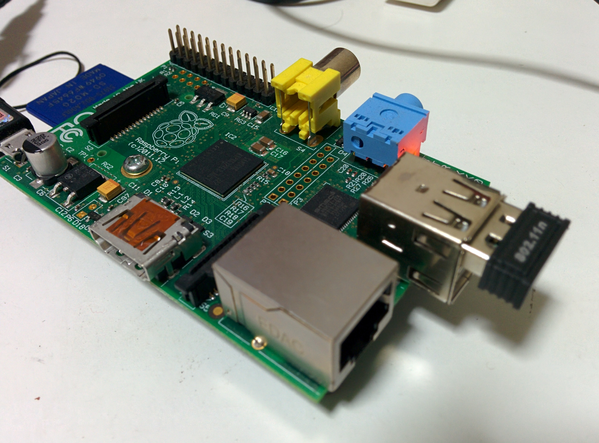

I spent the last couple of days working on the [RaspberryPi Soundboard][0], and I must say I'm kind of frustrated with Linux Audio. It seems much harder to get stuff working when you want to keep things simpler and not use a GUI.

This is what I've achieved.

1\. I have a fully configured (WiFi, SSH, etc, etc) Pi running [Archlinux][1] + [i3wm][2] for GUI

2\. I have [Mumble][3] running from the command line even when no display is connected to the Pi. "_Yay!_"

3\. I have [Pulseaudio][4] running with all the correct settings on the Pi.

The main issue I faced was piping the audio. As much as Pulseaudio is the solution to mix and pipe audio around, letting me pipe audio coming from a player (say [aplay][5] or [sox][6])  into another application is really difficult. I faced a couple of main issues.

1\. It seem none of the players let you choose which "sink" in Pulseaudio should they connect to. I only saw that option in [mpd][7], but that seemed like a total overkill for what I want to do.

2\. While using Pulseaudio's _sink.monitor _feature works perfectly for my[streaming server use case][8], the soundboard has a slightly different needs. Here we need the audio from the player to end up in Mumble. I am envisioning a Pulseaudio configuration along this line.

aplay **=\>** Pulseaudio null-stream **--\>** stream.monitor **=\>** Mumble.

3\. Finally, getting Mumble to receive audio from Pulseaudio is straightforward, but to set it to receive it from a monitor of a sink seems challenging. The funny bit was I could easily do it using GUI ([pavucontrol][9]) but couldn't find the command (pacmd?? pactl??) to do that.

Any ideas or suggestions would be welcome! Please comment below!

[0]: http://chinpen.net/blog/2014/01/raspberrypi-soundboard-intro/
[1]: http://archlinuxarm.org/packages
[2]: http://i3wm.org/docs/userguide.html
[3]: http://mumble.sourceforge.net
[4]: http://pulseaudio.org
[5]: http://alsa.opensrc.org/Aplay
[6]: http://sox.sourceforge.net/sox.html
[7]: http://mpd.wikia.com
[8]: http://chinpen.net/blog/2013/11/streaming-audio/
[9]: http://freedesktop.org/software/pulseaudio/pavucontrol/
