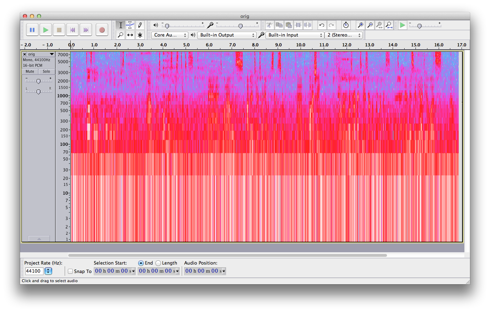
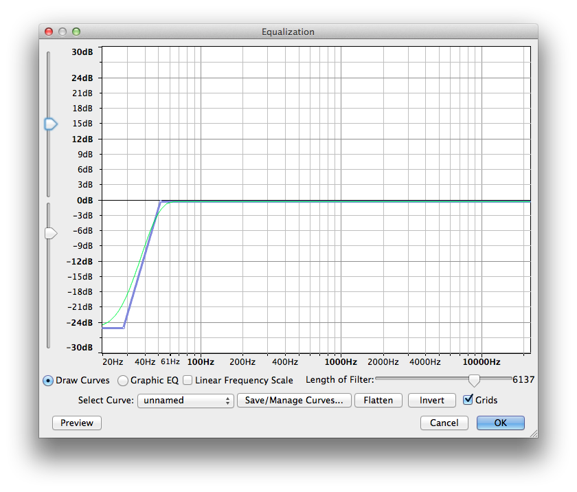
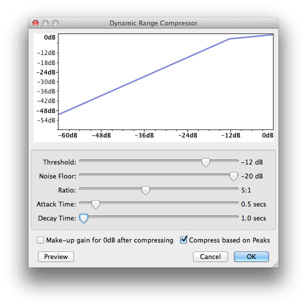
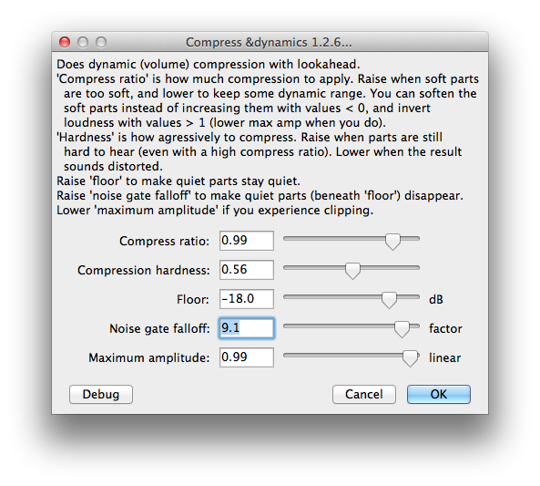
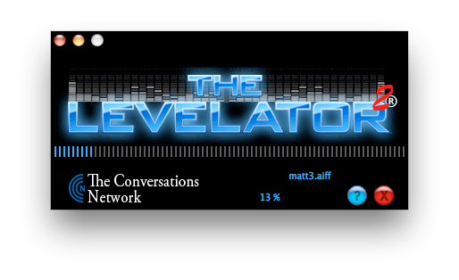
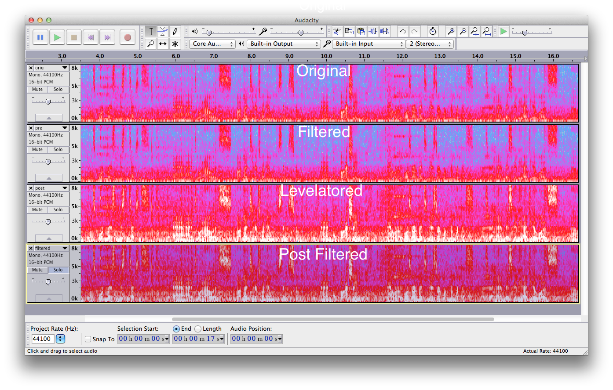

### the recording

We recently did a special podcast recording with [Matt Mullenweg](http://ma.tt) of WordPress fame, on [We Build Live (WBL)](http://live.webuild.sg/). WBL is an interview podcast, [which is recorded live](http://chinpen.net/streaming-audio/), where we talk to awesome developer, makers, designers.

Unforunately, because of the circumstances, we had to record the podcast in a noisy restaurent. The microphone we used was a [Blue Snowball](http://bluemic.com/snowball/), which is a pretty good mic.

But the positioning of the mic and the ambience yielded a pretty noisy recording.

Here's a small clip from the original recording...

<audio controls="controls" preload="none">
	<source src="../audio/2014/06/orig.wav" type="audio/wav">
</audio>

_All the recordings here are normalized to 0dBFS for the entire recording_

A quick look at the spectrum in [Audacity](http://audacity.sourceforge.net/) showed a ton of noise at low frequencies (less than 100Hz range)

### filtering the noise

I got out the [Equalizer](http://manual.audacityteam.org/o/man/equalization.html) in Audacity and created a quick lowpass filter. Although Audacity does have a [Lowpass Filter plugin](http://manual.audacityteam.org/o/man/low_pass_filter.html), it wasn't behaving that day, and I do like to have a tad more control over the dropoff.

I listened my way to the values for low pass filter shown above. Too high a cut off and it'd take off some of the vocal quality in the interview itself.

At the end of that I had something that sounded like this..

<audio controls="controls" preload="none">
	<source src="../audio/2014/06/prelevel.wav" type="audio/wav">
</audio>

### compressors

Better, but the voice is too soft and the noise in between the words of the speech is too high. This is a job for a [dynamic range compressor](http://en.wikipedia.org/wiki/Dynamic_range_compression)! A dynamic range compressor is like a automator for the volume of a track it makes the soft parts louder and the loud parts softer. The settings/parameters on the compressor let you decide which parts are considered loud/soft.

I started off with [Audacity's builtin compressor](http://manual.audacityteam.org/o/man/compressor.html).

I tried all sorts of parameters, but I couldn't get the noise out and the voices loud enough. Dang!

Next, I found a [highly recommended Nyquist plugin Compressor](http://theaudacitytopodcast.com/chriss-dynamic-compressor-plugin-for-audacity/) for Audacity. I played with that for a quite while to no avail. Was still unable to boost the voices and not the noise.

### levelator

While I was looking around for other Compressor plugins to try, I saw a post from Daniel of [The Audacity to Podcast](http://theaudacitytopodcast.com/) on [compressor showdown](http://theaudacitytopodcast.com/tap065-audacity-compressor-showdown/). In his set of Compressors he had also added the venerable [Levelator](http://en.wikipedia.org/wiki/Levelator).

Levelator is an awesome piece of software by [Doug Kaye](http://www.dougkaye.com/)and Bruce and Malcolm Sharpe, which levels the loud and soft parts of your audio file to make it sound level. It's deigned to be used for voices (The Conversation Networks podcasts), and does a awesome job of levelling multiple voices which might be recorded at slightly different levels.

Sadly when [The Conversation Networks ](http://web.archive.org/web/20130729200341id_/http://www.conversationsnetwork.org/)closed down in 2012 so did the Levelator, althoug you can [get a copy from archive.org](http://web.archive.org/web/20130729204551id_/http://www.conversationsnetwork.org/levelator/). _(Yay! Archive.org. Please [donate to them to keep them running](https://archive.org/donate/index.php).)_

Also, Doug and gang never open sourced the Levelator, so as much as I wished for a command line version or even to jump in and maintain it myself, I can't. _(Boo for non-open software)_

Having used and loved The Levalator before, I decided to give it a try. I was blow away by the results.

Here's a comparison of the spectrums. Look the difference between the bright bits between the `Filtered` and `Levelatored`. Levelator was able to find the perfect setting to boost the voices and yet keep the noise floor pretty low.

Take a listen...

<audio controls="controls" preload="none">
	<source src="../audio/2014/06/postlevel.wav" type="audio/wav">
</audio>

### more filtering

Finally the Levelator had managed to bring up some of the that low frequency noise, so I ran the audio through the same lowpass filter as earlier to reduce some of the low frequency noise.

Here is what the final audio sounded like...

<audio controls="controls" preload="none">
	<source src="../audio/2014/06/postfilter.wav" type="audio/wav">
</audio>

Levelator saved the day once more. I'm amazed by how well it works all the time. I would [love to understand the inner workings of the Levelator](http://web.archive.org/web/20130729204708id_/http://www.conversationsnetwork.org/levelatorAlgorithm) and hopefully make a open source command line version of it someday.

