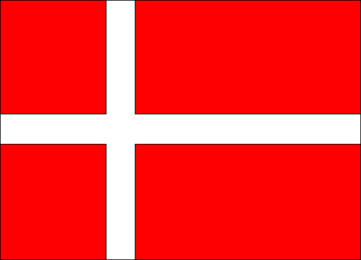

OK. This is too much.

I suddenly have this urge to go on Exchange again. Rather to go back to Danmark and study as an exchange student in DTU. **Og , selvfølgelig læse Dansk, en gang tid**. All over Again!!

I mean it was soooo coool. All the people I met there. All the adventures that we had. All the [places we visited.][0] And of course all the parties that we had. I am missing it.

What sucks is looking at people blogging from exchange and feeling **jealous**. Especially so when you have been to places that they are blogging from. Its like _"I know that. I have seen that. I was standing right over there!!"_

Man, I am sure all those who have been on exchange will agree, hands down, the best time for your Uni-life.

Now my friends are asking me to visit them again!! Oh man, I am soooo tempted to go back. How I wish I could just heck these exams and tour around Europe for a whole month, or maybe two or more. :P:P

My friends are asking me to make plans for next summer to Italy or Greece. **I wanna go**! But I really doubt I will. Jobs and stuff would have started then. So I guess not for 3 more years then. Thats too late then. But then where is Europe going. It will always be there as it is. So there is no hurry.

OK! Anyway, I will surely go one day. Like I said to so many of my friends from Denmark, "I promise to come back, some day". Hope that 'some day' does happen some day.

As Momo said. **Till Next.**

[0]: blog/norway/
