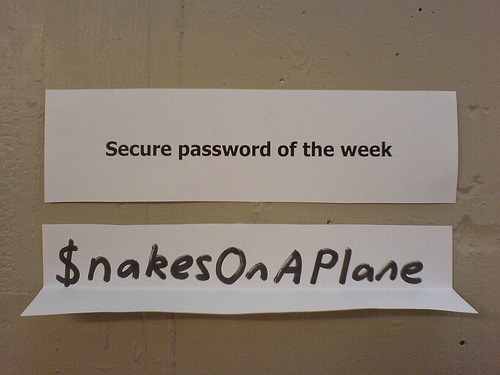

With the recent spate of attacks by [LulzSec][0] and [Anonymous][1] and the subsequent password leaks, keeping your passwords safe and secure has become an extremely important part of doing anything online. Passwords are used to protect any and all information you put online, and hence are extremely important to ensure that only you are allowed to access and change that information. Of course we know this! And now we also know, that [we can't trust big players like Sony][2] and [even some national agencies][3] to do just that. Whatever the reasons might be, it seems mighty easy to allow access to your password database (and [sometimes even storing plain-text passwords there][4]). So, finally, the responsibility of keeping our passwords safe lies on us. But sadly, the lazy bums that we are, almost everyone I know has at least one vulnerability in their password generation and management schemes.. Luckily for us (and thanks to the geeks) there are many simple ideas and tricks one can use to make your password much safer and secure. Here are a few.

[][5]

**1.  Stop reusing the same password on multiple websites.**

This is the cardinal sin. Doing this ensures that if your password gets leaked by one website/service ([like Sony for example][6]), then whoever get's your password can log into **ALL** your other accounts!

So what can you do? Simple! Use a different password for each website. "Does that mean I have to remember as many passwords as I have gmail accounts?" Yes! So stop registering more gmail accounts or start using a password manager. A simple and awesome way to do this is using [SuperGenPass][7]. This allows you to just have 1 (master) password but hashes it with the domain name to give you a different password for each website (that does mean it's not useful if you want to have 10 gmail accounts either).

**2. Use a strong password.**

This is very critical. In the cases where your [password is hashed][8] when stored on the server (as it should be), the only way for an attacker to retrieve it is to do an 'offline' attack. There are two general ways of doing this. Dictionary and Bruteforce.

In a **Dictionary** attack, a 'dictionary' of common passwords based on commonly used words and some modifications ([using 1337 symbols][9], etc) is used to generate the hashes. The hashes are then compared with your password hash. Hence if you had been using one of the words in the 'dictionary'  your password can be guessed this way. So it's extremely important that you ensure that you don't use a dictionary word as your password (['password' is a great example of that][10]). But don't be fooled thinking that **ONLY** words in a actual dictionary are used. There are many ways of generating lists of commonly (or not so commonly) used words. For example, crawling the internet, and doing all sorts of simple and complex modifications (like concatenation, substitution, reversing, capitalization, etc). The weakness to this attack is that it only works when the password is based on some known word.

[][11]

The other type of attacks is **Bruteforce**. This technique just tries out all combinations. It only works best when you have loads of time (hence only an offline attack), and [tonnes of computational power][12] to do thousands/millions of hashes and comparisons every second to try out ALL combinations. So for a simple example, they can start trying out with a,b,c,d,..., A,B,C,D,...1,2,3,4....aa,ab,ac,ad.. and so on and so forth. The [exhaustiveness of this method ][13]means that **ANY** password can be theoretically guessed if given enough time. Now how much is enough. [Steve Gibson of GRC fame ][14]made a [great website about how long it will take to theoretically break a password][15]. Play around with the tool and see how strong your password is. The more type of characters (lower case, UPPER CASE, numbers and symbols) you use, the stronger your password becomes. This is a result of needing to try out a lot more combinations for **EVERY** character.

Also the other way to strengthen your password is to increase the length. The longer the password the more time (even in trillions of years) it will take to crack it, even with technology which 100x faster than what we have today. The [GRC password haystacks site ][15]shows this quite well.

So knowing the working of these two common attacks, a good password should be not commonly used and long. There have been many ideas about this. But finally it boils down to this. Your passwords need to be a combination of **ALL** the 4 main types of characters (lower case, UPPER CASE, numbers and symbols), something not based on a commonly used word, and really long (16-20 characters to say the least). A good way to have a password which is not based on any words is using some kind of random word generation to generate a password with the 4 main types of characters in it.

But it's hard to remember a 20 character password which is a random sequence of characters. So, there is [another trick that Steve Gibson just came up with][16]. While it's important to have all the 4 types of characters in the password, just **one instance** of the 4 types is enough to add all the strength you can get from the character types. Hence, just having one of each of the 4 types and then the other 16 of a single type is good enough. This allows you to have the complexity of the 4 types and the length combined to give you a strong password. Steve's idea is to have a random 4 character (of 4 types) sequence and then add 16 letters around it. For example 'aaaaaaaaaaaa4B(kaaaaaaaaaaaaaaaa'. This makes it long, complex but much simpler to remember.

**3. Manage your passwords properly.**

If you're those with awesome memory and can remember each of your 20 character password (maybe you use Steve's trick) then good for you. For the rest of us, we need something to remember our passwords. There are [many tools][17] (including some built into most browsers) to help us remember our passwords. Most rely on one single password (master password) which you have to memorize and which in turn allows you to access a bank of the rest of your passwords. But don't be fooled thinking that just because you're using a password bank, all your passwords are safe all the time. Point \#1 and \#2 above still apply here for ALL your passwords.

[][18]

The important thing to consider when using such a tool it itself is saving only the hash of your password and not the plain text. Getting such a password bank hacked into is a 100x worse than just having a google account getting hacked, as most of the time the bank also stores which websites the passwords are for. So it's a sitting duck for the hackers. I personally love [LastPass][19], and the beauty of this tool is that all the hashing and unhashing is done on client side using the password as a key, hence even if LastPass get's hacked, you will only stand to loose the hashes of your passwords. And assuming you have followed point \#2 you'll be safe.

The other great thing about these tools is most provide a way generate good random passwords, and many plug into your browser so you don't have to do much copy-pasting.

**4. Change your passwords often.**

This is also important. Many services force you to change your passwords every few months. That's great. That stops many types of offline attacks as even though they might be able to find your password, it might have been changed by that time as it can take loads of time to run dictionary attacks (as we have seen).

Some password management tools also have reminders to tell you to change your passwords regularly, which is really useful.

**5. Use Multifactor Authentication (if possible).**

[Multifactor Authentication][20] uses a 'Out of Channel' message to verify the authenticity of entity trying to login. This has been done using small tokens which generate random numbers (with limited time validity) and are synced with the server. These numbers allow the 'Out of Channel' verification of the authenticity. This has been common in the world of Internet Banking, but recently other services have been using it as well. Most notably [Google has started using 2 Factor Authentication][21] using Apps on your smart phones or SMS.

[][22]

This system ensures that you are in possession of both the password and the device (token or smartphone) at that given moment to authenticate you. This adds another layer, and thus can't be broken by any types of attacks discussed previously. But one has to be careful to carry his/her device with him/her all  the time and not to loose it. But 2 factors are always better than 1..

So there you go, 5 tips and tricks to ensure your data is safe and secure on the Internet using passwords. Be sure to use them all and stay safe.

[0]: http://www.engadget.com/2011/06/02/sony-pictures-hacked-by-lulz-security-1-000-000-passwords-claim/
[1]: http://www.bbc.co.uk/news/technology-13749181
[2]: http://www.washingtonpost.com/blogs/post-tech/post/lulzsec-releases-sony-usernames-passwords/2011/06/02/AGY4zWHH_blog.html
[3]: http://www.theinquirer.net/inquirer/news/2086549/anonymous-hacks-turkish-government-web-sites
[4]: http://www.reddit.com/r/PS3/comments/gyi7j/just_to_be_sure_was_sony_storing_passwords_in/
[5]: img/2011/07/226873460_c8eabd2911.jpeg
[6]: http://arstechnica.com/tech-policy/news/2011/06/sony-hacked-yet-again-plaintext-passwords-posted.ars
[7]: http://supergenpass.com/
[8]: http://en.wikipedia.org/wiki/Cryptographic_hash_function
[9]: http://en.wikipedia.org/wiki/Leet
[10]: http://www.troyhunt.com/2011/06/brief-sony-password-analysis.html
[11]: http://www.flickr.com/photos/edublogger/5818354695/
[12]: http://en.wikipedia.org/wiki/EFF_DES_cracker
[13]: http://en.wikipedia.org/wiki/Brute-force_attack
[14]: http://steve.grc.com/
[15]: https://www.grc.com/haystack.htm
[16]: http://twit.tv/sn303
[17]: http://en.wikipedia.org/wiki/Category:Password_managers
[18]: img/2011/07/Screen-shot-2011-07-07-at-4.21.23-PM.png
[19]: https://lastpass.com
[20]: http://en.wikipedia.org/wiki/Two-factor_authentication
[21]: http://www.google.com/support/accounts/bin/topic.py?hl=en&topic=28786
[22]: http://www.flickr.com/photos/chrisdag/4381916051/
