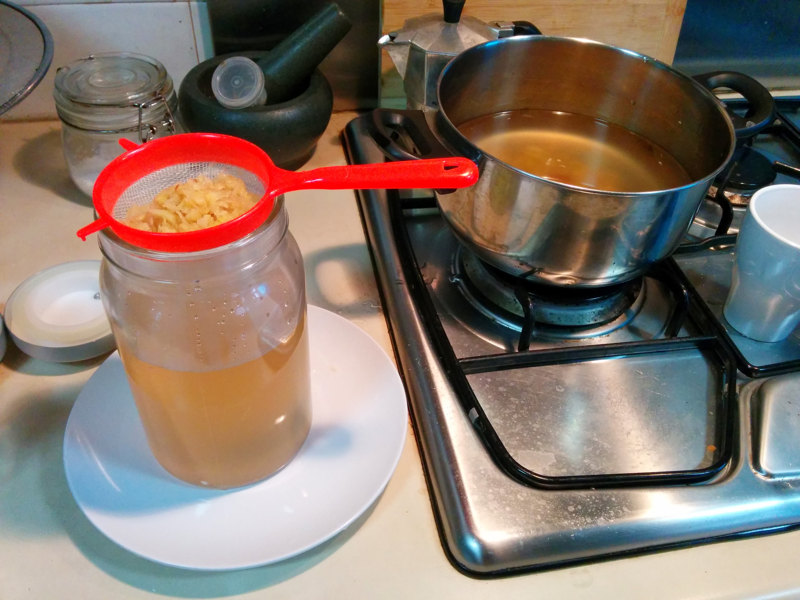
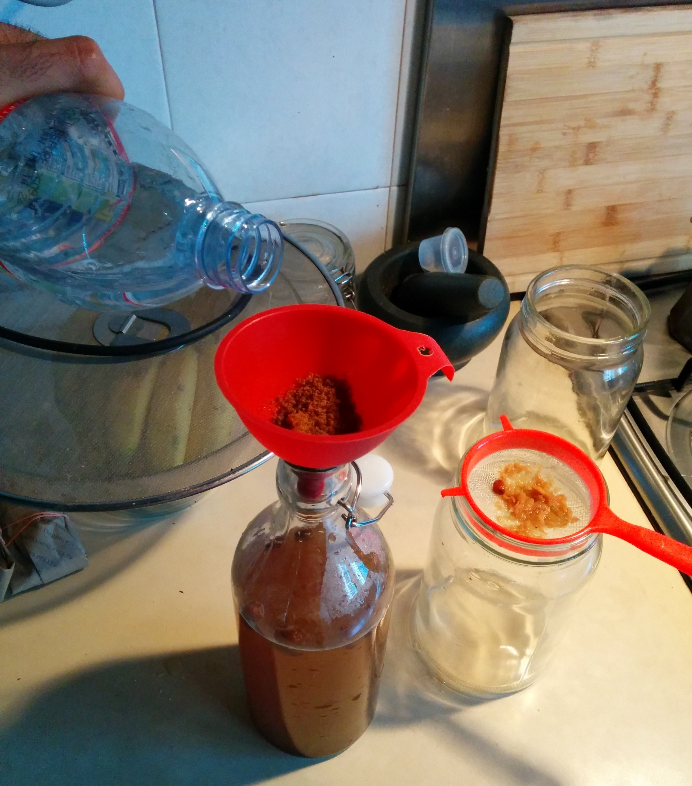
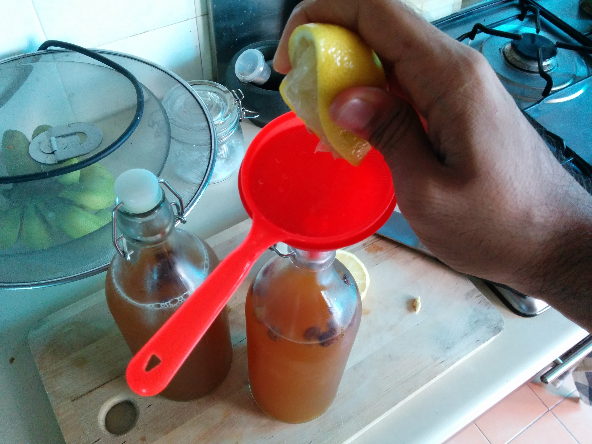

I've been dabbling with simple fermentation for a few years now. [Kefir (an awesome probiotic)][0], and yeast and do wonders to sugar in it's various forms.

I started with making gingerale based on [this recipe from David B. Fankhauser at the U.C. Clermont College][1] with mixed results.

Then came [version 0.1][2] to [version 1.0][3] each with small changes to the recipe.

Finally I have converged to a recipe which is closer to beer brewing techniques than David's original recipe. The ingredients are more or less the same as the previous versions.  Here's how I do ginger ale.

0. Clean and dry your fermentation jars, bottles, pots really well. This is pretty important.

1. Grate Ginger

	I try to use young ginger, it's a little more 'fruity' and intense (I like my gingerale intense).  The amount of ginger can be varied for how 'gingery' you want the final gingerale. I used about 4 teaspoons here.

	

3. Measure the total amount of liquid you will be able to fit in your fermentation jars. I use 2 [IKEA Burken jars][4] to ferment, they fill about 1liter each.

	

4. Add that amount of tap water to a pot and put it on the heat. Next, add the grated ginger, and let it boil for . This is similar to making a [wort during brewing][5].

5. Optionally you can drop in a small stick of cinnamon to the boiling wort for added flavour.

	

	Boiling achieves a couple of things. [Tap water (atleast in Singapore) is fluorinated][6], which is not very conducive for our probiotics. So boiling should get rid of all the fluorine and other additives(_Correction based on comments below :_ Fluorides in the water are salts and hence will not evaporate by boiling. [Chlorine which is also added to tap water][7] is the one which evaporates away when boiled.) It also extracts the flavour from the ginger into the water.

6. Let the hot wort cool down by leaving the pot open. This will also enable the fluorine to evaporate off.

	

7. Once the wort is cooled, we can filter the ginger and cinnamon out of it and add the yeast.

	

8. You may want to leave some of the ginger in the wort to make the ginger ale more intense, but some people might not like bits of ginger when they drink their gingerale (I love it).

	

9. I really would have loved to use [champagne yeast][8], but I didn't have any handy. Bakers yeast (as I used here) gives it a slight 'yeasty' taste, but does the trick. I have also done this with Kefir.

	

10. Add sugar to the wort. I usually start with 4 teaspoons of brown sugar (gives it a nice body). In Singapore we get something called Gula Merah (Red Sugar), which I tend to use. Through out the fermenting process, I might add more sugar if it starts tasting sourish (too much sugar has been consumed by the yeast).

	

11. Optionally, Add some raisins to the mixture. [Grape skin are known to have natural yeast (which ferment the wine)][9], so raisins help to add a bit of kick to the gingerale. This idea came from [my friend Stephan][10] talking about how his grandma used to make gingerale with raisins. Theoretically, I think you might be able to pull it off just using raisins without yeast, but I haven't tried that yet.

12. Let the wort ferment at room temperature in a shaded place (no direct sunlight) for 3 days.

	The longer you let it ferment, more sugar will be turned into alcohol. So you can stop when you are comfortable. I keep tasting the fermenting wort daily.

	The IKEA Burken jars make an awesome fermenting jar as they let the carbon-dioxide generated during the fermentation out through the seal. It's not an airlock, but I feel for small term fermentation it's OK.

13. After 3 days I transfer the gingerale to airtight bottles to carbonate. Once again I use [IKEA KORKEN bottles with a stopper][11].

	

	In this stage you have to carefully control the carbonation by controlling the temperature of the gingerale. Leaving it at room temperature will cause it to carbonate quickly, and you might have spillage when you open the bottle.

	I prefer to leave the gingerale in the fridge for a 3-4 days, and let it slowly carbonate ([water does carbonate better when it's cold][12]). But if it doesn't carbonate in your fridge, you can try leave it out for a 5-6 hours and then putting in fridge.

	

14. I do check every few days incase I need to top up the sugar if it has all been consumed by the yeast. Ensure if you add water at this stage to the gingerale, you add distilled water (without fluorine chlorine/fluoride).

	

15. When I have achieved your target carbonation, I add juice of a quarter lemon per bottle. This reduces the fermentation and also adds a nice flavour. You're now ready to enjoy the gingerale.

	Airtight bottles with gingerale sitting in the fridge can still  ferment and carbonate. So do check if it's not overly pressurised every few days if you're leaving the gingerale in the fridge for a long time. You can have broken glass bottles due to over-pressurisation.

Try it out and let me know how it goes. And if you find a hack or improvement be sure to leave a comment below!

[0]: http://en.wikipedia.org/wiki/Kefir
[1]: http://biology.clc.uc.edu/fankhauser/cheese/ginger_ale_ag0.htm
[2]: http://kitchenhacks.tumblr.com/day/2012/12/23
[3]: http://kitchenhacks.tumblr.com/day/2013/10/12
[4]: http://www.ikea.com/sg/en/catalog/products/40179816/
[5]: http://en.wikipedia.org/wiki/Wort
[6]: http://en.wikipedia.org/wiki/Fluoridation_by_country
[7]: http://www.pub.gov.sg/general/watersupply/Pages/WaterTreatment.aspx
[8]: http://www.amazon.com/Champagne-Yeast-10-Packs-Dried/dp/B00434CB74
[9]: http://en.wikipedia.org/wiki/Yeast_in_winemaking
[10]: http://blog.werkswinkel.net/
[11]: http://www.ikea.com/sg/en/catalog/products/00213558/
[12]: http://chemwiki.ucdavis.edu/Physical_Chemistry/Physical_Properties_of_Matter/Solutions/Solubilty/Solubility_and_Factors_Affecting_Solubility
