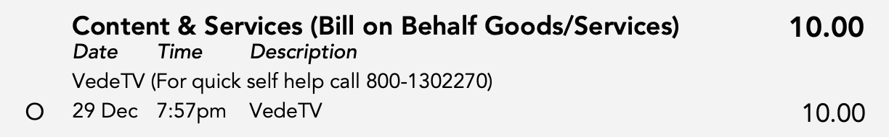
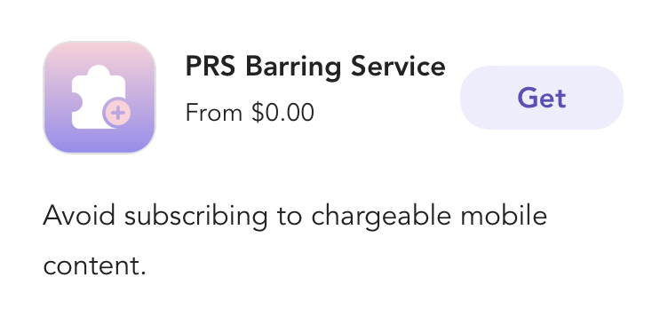

I recently experienced an infuriating experience with one of our local telcos, [Singtel](https://www.singtel.com/) that instigated me to blog about this evil practice that telcos tend to do.

Most telcos don't want to get stuck as a cellular service provider, and they try to add "Value Added Services" on top of the basic services (3G/4G/5G/Voice, etc) to allow them to generate more revenue. Unfortunately, none of the telcos I've seen can offer valuable services. However, there is a financial interest in getting users to sign up for them, whether they want it or not.

And this is where the evil bit comes up. My first bout with this was a good 15yrs ago when a non-technical family member got a new mobile handset from their telco. It was a Samsung X640 (or something similar).

 Source : <a href="">https://commons.wikimedia.org/wiki/File:SGH-X640.jpg</a>

Note the BIG Blue Button in the center with the `𝒊` symbol. That button was officially defined as a "WAP access key" by the manual, but with the telco in question, that would automatically subscribe the user to its WAP "value-added service", as soon as that button was pressed. So we saw monthly subscription charges on the telephone service bills soon after we got this new mobile handset. I called the telco and I was told, the service was requested by "clicking on the `𝒊` button".

This is a FAIL at 2 levels, firstly at a phone UX level, that's a bad place to have a button that launches a WAP browser without asking for user confirmation. And secondly, and more fundamentally, there is something broken with the model that the telco can charge you without formally verifying that you want the service.

And coupled with non-technical users, this enables the telcos to effectively scam people for subscriptions to services they didn't want.

The more recent experience with this was even more infuriating. Again a non-technical family member saw a charge for a "value-added service" called "VedeTV". A quick google showed, that [I wasn't the only one at the receiving end of this](https://www.reddit.com/r/singapore/comments/zjr1js/vedetv_is_this_a_scam/). The telco claimed that it was triggered by an SMS that was clicked on and an account with the merchant that was created by the telco subscriber. But I verified that never happened.

From what I can gather based on my call with the telco, these "3rd party merchants" can enable subscriptions for their service using your telco account. They claim to do "2-factor authentication", But one can easily imagine, these smaller providers likely don't have great security, and can their ability to charge a user through the telco can be exploited by someone else, even if they're not being evil.

To me though, the real issue is having the mechanism for a 3rd party vendor to be able to add subscription charges to the contract between me at the telco. How much ever security one adds, that mechanism is just ripe for abuse.

Now for the PSA: all telcos in Singapore (and likely many around the world), have some internal switch to turn off that mechanism. Singtel, for example, calls it ["Premium Rate Service (PRS) Barring Service"](https://www.singtel.com/personal/i/premium-rate-service-prs-barring-service/faq) and Singtel (thankfully) allows it to be enabled from their apps. Please enable this for yourself and your friends and family if you don't want nasty surprises. If it's not easily accessible, please call your telco and ask.

